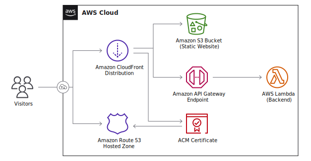

# Terraform Module - Lightweight S3+Lambda Site Hosting



This module provides an **opinated** solution for hosting lightweight websites using
AWS Simple Storage Service (S3) and AWS Lambda (optional).

In order to use this module, you must:
 - **Have a completely static frontend.**  
   I highly recommend using a static site generator like [GatsbyJS](https://gatsbyjs.com)

 - **Manage your domain name via Route 53.**  
   Route 53 is used to automatically provision ACM certificates.
   While I could organize this module to remove this requirement, as stated above, this
   module is opinated 🙂.

If no lambda parameters are specified, no lambda will be deployed.

## Examples

### Basic Usage with no Lambda

```tf
module "static_hosting" {
  # Alternatively, you may use
  # source = "git::https://gitlab.com/finewolf-projects/terraform-aws-lightweight-hosting.git?ref=v3.0.0"

  source = "gitlab.com/finewolf-projects/terraform-aws-lightweight-hosting/aws"
  version = "3.0.0"

  domains  = ["example.org", "www.example.org"]
  zone_ids = ["Z00000000000000000000", "Z00000000000000000000"]

  index_document = "index.html"
  error_document = "404.html"
}
```

### Usage with a Lambda Backend

```tf
module "static_hosting" {
  source = "gitlab.com/finewolf-projects/terraform-aws-lightweight-hosting/aws"
  version = "3.0.0"

  domains  = ["example.org", "www.example.org"]
  zone_ids = ["Z00000000000000000000", "Z00000000000000000000"]

  index_document = "index.html"
  error_document = "404.html"

  lambda_memory_size = 256
  lambda_package_config = {
    filename  = "/home/ci/builds/node-application.zip"
    s3_bucket = aws_s3_bucket.storage_bucket.id
    s3_key    = "lambda/node-application.zip"
    runtime   = "nodejs14.x"
    handler   = "index.handler"
  }

  lambda_timeout       = 20
  lambda_log_retention = 7

  lambda_environment = {
    ThisIs__ACustom__EnvVar = "HelloWorld"
  }
}

# Storage bucket for artifacts
resource "aws_s3_bucket" "storage_bucket" {
  bucket = "example.org-artifacts"
}

resource "aws_s3_bucket_acl" "bucket_acl" {
  bucket = aws_s3_bucket.storage_bucket.id
  acl    = "private"
}

resource "aws_s3_bucket_public_access_block" "bucket_public_access_block" {
  bucket = aws_s3_bucket.storage_bucket.id

  block_public_acls       = true
  block_public_policy     = true
  ignore_public_acls      = true
  restrict_public_buckets = true
}

resource "aws_s3_bucket_versioning" "bucket_versioning" {
  bucket = aws_s3_bucket.storage_bucket.id

  versioning_configuration {
    status = "Suspended"
  }
}
```

## Requirements

| Name | Version |
|------|---------|
| <a name="requirement_terraform"></a> [terraform](#requirement\_terraform) | >= 1.0 |
| <a name="requirement_aws"></a> [aws](#requirement\_aws) | ~> 4.3 |
| <a name="requirement_random"></a> [random](#requirement\_random) | ~> 3.1 |

## Providers

| Name | Version |
|------|---------|
| <a name="provider_aws"></a> [aws](#provider\_aws) | 4.3.0 |
| <a name="provider_random"></a> [random](#provider\_random) | 3.1.0 |

## Modules

No modules.

## Resources

| Name | Type |
|------|------|
| [aws_acm_certificate.cert](https://registry.terraform.io/providers/hashicorp/aws/latest/docs/resources/acm_certificate) | resource |
| [aws_acm_certificate_validation.cert_validation](https://registry.terraform.io/providers/hashicorp/aws/latest/docs/resources/acm_certificate_validation) | resource |
| [aws_apigatewayv2_api.rest_api](https://registry.terraform.io/providers/hashicorp/aws/latest/docs/resources/apigatewayv2_api) | resource |
| [aws_apigatewayv2_integration.lambda](https://registry.terraform.io/providers/hashicorp/aws/latest/docs/resources/apigatewayv2_integration) | resource |
| [aws_apigatewayv2_route.lambda_route](https://registry.terraform.io/providers/hashicorp/aws/latest/docs/resources/apigatewayv2_route) | resource |
| [aws_apigatewayv2_stage.apigw_stage](https://registry.terraform.io/providers/hashicorp/aws/latest/docs/resources/apigatewayv2_stage) | resource |
| [aws_cloudfront_distribution.cf_distribution](https://registry.terraform.io/providers/hashicorp/aws/latest/docs/resources/cloudfront_distribution) | resource |
| [aws_cloudwatch_log_group.cloudwatch_group](https://registry.terraform.io/providers/hashicorp/aws/latest/docs/resources/cloudwatch_log_group) | resource |
| [aws_iam_role.lambda_role](https://registry.terraform.io/providers/hashicorp/aws/latest/docs/resources/iam_role) | resource |
| [aws_iam_role_policy_attachment.lambda_role_basic_exec_role](https://registry.terraform.io/providers/hashicorp/aws/latest/docs/resources/iam_role_policy_attachment) | resource |
| [aws_lambda_function.lambda](https://registry.terraform.io/providers/hashicorp/aws/latest/docs/resources/lambda_function) | resource |
| [aws_lambda_permission.apigw_lambda_permission](https://registry.terraform.io/providers/hashicorp/aws/latest/docs/resources/lambda_permission) | resource |
| [aws_route53_record.r53_a](https://registry.terraform.io/providers/hashicorp/aws/latest/docs/resources/route53_record) | resource |
| [aws_route53_record.r53_aaaa](https://registry.terraform.io/providers/hashicorp/aws/latest/docs/resources/route53_record) | resource |
| [aws_route53_record.r53_domain_validation_record](https://registry.terraform.io/providers/hashicorp/aws/latest/docs/resources/route53_record) | resource |
| [aws_s3_bucket.bucket](https://registry.terraform.io/providers/hashicorp/aws/latest/docs/resources/s3_bucket) | resource |
| [aws_s3_bucket_acl.bucket_acl](https://registry.terraform.io/providers/hashicorp/aws/latest/docs/resources/s3_bucket_acl) | resource |
| [aws_s3_bucket_policy.bucket_policy](https://registry.terraform.io/providers/hashicorp/aws/latest/docs/resources/s3_bucket_policy) | resource |
| [aws_s3_bucket_public_access_block.bucket_public_access_block](https://registry.terraform.io/providers/hashicorp/aws/latest/docs/resources/s3_bucket_public_access_block) | resource |
| [aws_s3_bucket_versioning.bucket_versioning](https://registry.terraform.io/providers/hashicorp/aws/latest/docs/resources/s3_bucket_versioning) | resource |
| [aws_s3_bucket_website_configuration.bucket_website_configuration](https://registry.terraform.io/providers/hashicorp/aws/latest/docs/resources/s3_bucket_website_configuration) | resource |
| [aws_s3_object.lambda_zip_package](https://registry.terraform.io/providers/hashicorp/aws/latest/docs/resources/s3_object) | resource |
| [random_uuid.random_uuid](https://registry.terraform.io/providers/hashicorp/random/latest/docs/resources/uuid) | resource |
| [aws_iam_policy_document.bucket_policy](https://registry.terraform.io/providers/hashicorp/aws/latest/docs/data-sources/iam_policy_document) | data source |
| [aws_iam_policy_document.lambda_iam_assume_policy](https://registry.terraform.io/providers/hashicorp/aws/latest/docs/data-sources/iam_policy_document) | data source |

## Inputs

| Name | Description | Type | Default | Required |
|------|-------------|------|---------|:--------:|
| <a name="input_apigw_name"></a> [apigw\_name](#input\_apigw\_name) | Name of the API Gateway Rest API. If left empty, a value will be derived from the first domain name. | `string` | `""` | no |
| <a name="input_apigw_payload_format_version"></a> [apigw\_payload\_format\_version](#input\_apigw\_payload\_format\_version) | The format of the payload sent to the lambda. | `string` | `"1.0"` | no |
| <a name="input_apigw_stage"></a> [apigw\_stage](#input\_apigw\_stage) | Name of the API Gateway Rest Stage. | `string` | `"api"` | no |
| <a name="input_apigw_throttling_burst_limit"></a> [apigw\_throttling\_burst\_limit](#input\_apigw\_throttling\_burst\_limit) | The throttling burst limit for the route. | `number` | `5` | no |
| <a name="input_apigw_throttling_rate_limit"></a> [apigw\_throttling\_rate\_limit](#input\_apigw\_throttling\_rate\_limit) | The throttling rate limit for the route.. | `number` | `50` | no |
| <a name="input_bucket_name"></a> [bucket\_name](#input\_bucket\_name) | S3 bucket name used to deploy the website resources on. If left empty, defaults to using the first domain as name. | `string` | `""` | no |
| <a name="input_cf_custom_behaviors"></a> [cf\_custom\_behaviors](#input\_cf\_custom\_behaviors) | List of additional CloudFront behaviors. | <pre>list(object({<br>    target_origin_id           = string<br>    path_pattern               = string<br>    allowed_methods            = list(string)<br>    cached_methods             = list(string)<br>    compress                   = bool<br>    viewer_protocol_policy     = string<br>    cache_policy_id            = string<br>    origin_request_policy_id   = string<br>    response_headers_policy_id = string<br>  }))</pre> | `[]` | no |
| <a name="input_cf_custom_origins"></a> [cf\_custom\_origins](#input\_cf\_custom\_origins) | List of additional custom origins for which to selectively route traffic to. | <pre>list(object({<br>    origin_id   = string<br>    domain_name = string<br>    custom_headers = list(object({<br>      name  = string<br>      value = string<br>    }))<br>    custom_origin_config = object({<br>      http_port              = number<br>      https_port             = number<br>      origin_protocol_policy = string<br>      origin_ssl_protocols   = list(string)<br>      origin_read_timeout    = number<br>    })<br>  }))</pre> | `[]` | no |
| <a name="input_cf_lambda_cache_policy_id"></a> [cf\_lambda\_cache\_policy\_id](#input\_cf\_lambda\_cache\_policy\_id) | Cache Policy Id to apply to the Lambda cache behavior of the CloudFront distribution. Defaults to 'Managed-CachingDisabled' | `string` | `"4135ea2d-6df8-44a3-9df3-4b5a84be39ad"` | no |
| <a name="input_cf_lambda_origin_id"></a> [cf\_lambda\_origin\_id](#input\_cf\_lambda\_origin\_id) | CloudFront origin id that will be used for the origin pointing to the API gateway. Will be automatically generated if empty. | `string` | `""` | no |
| <a name="input_cf_lambda_origin_request_policy_id"></a> [cf\_lambda\_origin\_request\_policy\_id](#input\_cf\_lambda\_origin\_request\_policy\_id) | Origin Request Policy Id to apply to the Lambda cache behavior of the CloudFront distribution. Defaults to 'Managed-Elemental-MediaTailor-PersonalizedManifests'. Leave empty for none. | `string` | `"775133bc-15f2-49f9-abea-afb2e0bf67d2"` | no |
| <a name="input_cf_lambda_response_headers_policy_id"></a> [cf\_lambda\_response\_headers\_policy\_id](#input\_cf\_lambda\_response\_headers\_policy\_id) | Response Headers Policy Id to apply to the Lambda cache behavior of the CloudFront distribution. Defaults to none. Leave empty for none. | `string` | `""` | no |
| <a name="input_cf_logging_config"></a> [cf\_logging\_config](#input\_cf\_logging\_config) | Provides logging configuration for the CloudFront distribution | <pre>object({<br>    bucket          = string<br>    include_cookies = bool<br>    prefix          = string<br>  })</pre> | <pre>{<br>  "bucket": "",<br>  "include_cookies": false,<br>  "prefix": ""<br>}</pre> | no |
| <a name="input_cf_minimum_protocol_version"></a> [cf\_minimum\_protocol\_version](#input\_cf\_minimum\_protocol\_version) | CloudFront SSL/TLS Minimum Protocol Version | `string` | `"TLSv1.2_2021"` | no |
| <a name="input_cf_price_class"></a> [cf\_price\_class](#input\_cf\_price\_class) | CloudFront Price Class | `string` | `"PriceClass_All"` | no |
| <a name="input_cf_s3_secret_ua"></a> [cf\_s3\_secret\_ua](#input\_cf\_s3\_secret\_ua) | Secret User-Agent used to prevent everyone but CloudFront from accessing the S3 Website Endpoint. If empty, a value will be automatically generated for you. | `string` | `""` | no |
| <a name="input_cf_website_cache_policy_id"></a> [cf\_website\_cache\_policy\_id](#input\_cf\_website\_cache\_policy\_id) | Cache Policy Id to apply to the default (S3 bucket) cache behavior of the CloudFront distribution. Defaults to 'Managed-CachingOptimized' | `string` | `"658327ea-f89d-4fab-a63d-7e88639e58f6"` | no |
| <a name="input_cf_website_origin_id"></a> [cf\_website\_origin\_id](#input\_cf\_website\_origin\_id) | CloudFront origin id that will be used for the origin pointing to the API gateway. Will be automatically generated if empty. | `string` | `""` | no |
| <a name="input_cf_website_origin_request_policy_id"></a> [cf\_website\_origin\_request\_policy\_id](#input\_cf\_website\_origin\_request\_policy\_id) | Origin Request Policy Id to apply to the default (S3 bucket) cache behavior of the CloudFront distribution. Defaults to 'Managed-CORS-S3Origin'. Leave empty for none. | `string` | `"88a5eaf4-2fd4-4709-b370-b4c650ea3fcf"` | no |
| <a name="input_cf_website_response_headers_policy_id"></a> [cf\_website\_response\_headers\_policy\_id](#input\_cf\_website\_response\_headers\_policy\_id) | Response Headers Policy Id to apply to the default (S3 bucket) cache behavior of the CloudFront distribution. Defaults to none. Leave empty for none. | `string` | `""` | no |
| <a name="input_domains"></a> [domains](#input\_domains) | List of domains for which the CloudFront Distribution will be serving files. | `list(string)` | n/a | yes |
| <a name="input_error_document"></a> [error\_document](#input\_error\_document) | Filename of the error document to be used in the bucket. | `string` | `"error.html"` | no |
| <a name="input_index_document"></a> [index\_document](#input\_index\_document) | Filename of the index document to be used in the bucket. | `string` | `"index.html"` | no |
| <a name="input_is_cloudfront_enabled"></a> [is\_cloudfront\_enabled](#input\_is\_cloudfront\_enabled) | Allows disabling the CloudFront distribution. Note that records will be deleted if CF is disabled. | `bool` | `true` | no |
| <a name="input_is_ipv6_enabled"></a> [is\_ipv6\_enabled](#input\_is\_ipv6\_enabled) | Toggles if IPv6 is enabled on the CloudFront distribution. If enabled, it will automatically create relevant AAAA records. | `bool` | `true` | no |
| <a name="input_lambda_architectures"></a> [lambda\_architectures](#input\_lambda\_architectures) | Instruction set architecture for your Lambda function. | `list(string)` | `[]` | no |
| <a name="input_lambda_environment"></a> [lambda\_environment](#input\_lambda\_environment) | Environment variables for the Lambda function. | `map(string)` | `{}` | no |
| <a name="input_lambda_function_name"></a> [lambda\_function\_name](#input\_lambda\_function\_name) | Name of the Lambda function. If left empty, a value will be derived from the first domain name. | `string` | `""` | no |
| <a name="input_lambda_image_config"></a> [lambda\_image\_config](#input\_lambda\_image\_config) | If using a container Lambda, provides image configuration options | <pre>object({<br>    image_uri         = string<br>    command           = list(string)<br>    entry_point       = list(string)<br>    working_directory = string<br>  })</pre> | <pre>{<br>  "command": [],<br>  "entry_point": [],<br>  "image_uri": "",<br>  "working_directory": ""<br>}</pre> | no |
| <a name="input_lambda_log_retention"></a> [lambda\_log\_retention](#input\_lambda\_log\_retention) | Amount of days the lambda logs are retained. Use -1 to leave the default value. | `number` | `-1` | no |
| <a name="input_lambda_memory_size"></a> [lambda\_memory\_size](#input\_lambda\_memory\_size) | mount of memory in MB your Lambda Function can use at runtime. | `number` | `128` | no |
| <a name="input_lambda_package_config"></a> [lambda\_package\_config](#input\_lambda\_package\_config) | If using a traditional Lambda, provides runtime and package options | <pre>object({<br>    filename  = string<br>    runtime   = string<br>    handler   = string<br>    s3_bucket = string<br>    s3_key    = string<br>  })</pre> | <pre>{<br>  "filename": "",<br>  "handler": "",<br>  "runtime": "provided",<br>  "s3_bucket": "",<br>  "s3_key": ""<br>}</pre> | no |
| <a name="input_lambda_role_name"></a> [lambda\_role\_name](#input\_lambda\_role\_name) | Name of IAM role to create for the Lambda function. If left empty, a value will be derived from the first domain name. | `string` | `""` | no |
| <a name="input_lambda_security_group_ids"></a> [lambda\_security\_group\_ids](#input\_lambda\_security\_group\_ids) | List of security group IDs associated with the lambda function. Only valid if subnets are specified. | `list(string)` | `[]` | no |
| <a name="input_lambda_subnet_ids"></a> [lambda\_subnet\_ids](#input\_lambda\_subnet\_ids) | List of subnets IDs associated with the lambda function | `list(string)` | `[]` | no |
| <a name="input_lambda_timeout"></a> [lambda\_timeout](#input\_lambda\_timeout) | Amount of time your Lambda Function has to run in seconds. | `number` | `3` | no |
| <a name="input_tags"></a> [tags](#input\_tags) | AWS tags to apply to every resource created by this module | `map(string)` | `{}` | no |
| <a name="input_zone_ids"></a> [zone\_ids](#input\_zone\_ids) | List of Route53 zone IDs for the domains specified in var.domains | `list(string)` | n/a | yes |

## Outputs

| Name | Description |
|------|-------------|
| <a name="output_acm_certificate_arn"></a> [acm\_certificate\_arn](#output\_acm\_certificate\_arn) | The ARN of the ACM Certificate |
| <a name="output_acm_certificate_id"></a> [acm\_certificate\_id](#output\_acm\_certificate\_id) | The ARN of the ACM Certificate |
| <a name="output_apigw_rest_api_arn"></a> [apigw\_rest\_api\_arn](#output\_apigw\_rest\_api\_arn) | The ARN of the API Gateway Rest API |
| <a name="output_apigw_rest_api_id"></a> [apigw\_rest\_api\_id](#output\_apigw\_rest\_api\_id) | The ID of the API Gateway Rest API |
| <a name="output_apigw_rest_api_invoke_url"></a> [apigw\_rest\_api\_invoke\_url](#output\_apigw\_rest\_api\_invoke\_url) | The URL to invoke the API pointing to the stage |
| <a name="output_cf_distribution_arn"></a> [cf\_distribution\_arn](#output\_cf\_distribution\_arn) | The ARN of the CloudFront distribution |
| <a name="output_cf_distribution_id"></a> [cf\_distribution\_id](#output\_cf\_distribution\_id) | The identifier of the CloudFront distribution |
| <a name="output_cf_s3_secret_ua"></a> [cf\_s3\_secret\_ua](#output\_cf\_s3\_secret\_ua) | Secret User-Agent used to prevent everyone but CloudFront from accessing the S3 Website Endpoint. |
| <a name="output_lambda_arn"></a> [lambda\_arn](#output\_lambda\_arn) | The ARN of the Lambda. |
| <a name="output_lambda_iam_role_arn"></a> [lambda\_iam\_role\_arn](#output\_lambda\_iam\_role\_arn) | The ARN of the Lambda's IAM role. |
| <a name="output_lambda_iam_role_id"></a> [lambda\_iam\_role\_id](#output\_lambda\_iam\_role\_id) | The ID of the Lambda's IAM role. |
| <a name="output_s3_bucket_arn"></a> [s3\_bucket\_arn](#output\_s3\_bucket\_arn) | The ARN of the S3 Bucket |
| <a name="output_s3_bucket_id"></a> [s3\_bucket\_id](#output\_s3\_bucket\_id) | The ID of the S3 Bucket |
| <a name="output_s3_bucket_website_endpoint"></a> [s3\_bucket\_website\_endpoint](#output\_s3\_bucket\_website\_endpoint) | The website endpoint associated with the S3 Bucket |